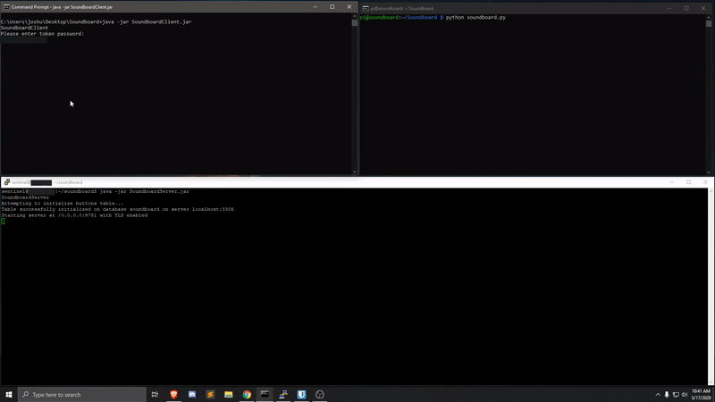

# Soundboard

*Client is on the top left, Pi program is on the top right, Server is on the bottom. This video shows a button press, seen with "Button 1 Pressed" on the Pi program. When the Client shows "[PRESS] Button 2 Pressed", this info was retrieved after a connection to the Server. These connections are shown in the Server logs, starting with "[CONN]".*

## Objective
The objective of this project was to use a Raspberry Pi & GPIO buttons to play sounds on a different computer. These connections must be secure and the Client that recieves these inputs may not contain any confidential info (passwords, database credentials, or other such pieces of info). This system is made up of three components, the Pi, Server, and Client, as seen in the "pi", "server", and "client" folders in the repository.

Component | Language
------------ | -------------
Pi | Python
Server | Java
Client | Java

For more info about each of the components, see "info.md" in each of the component directories.

## Hardware
- [Raspberry Pi 3 Model B](https://www.microcenter.com/product/460968/3_Model_B?src=raspberrypi)
- [Breadboard](https://www.amzn.com/B00LSG5BJK)
- [Cables](https://www.amzn.com/B01LZF1ZSZ)
- [Buttons](https://www.amzn.com/B01GN79QF8)

## Images

## Other Contributors
- Matthias Braun - Base server code for the Server component. Code used under the GNU GPL v3
- Prasanta Biswas - trustAllHosts() method in the Client component.
